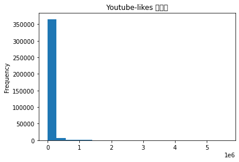

# 互评作业1: 数据探索性分析与数据预处理

> GitHub Address: [https://github.com/Nonsensersunny/bit-data-mining](https://github.com/Nonsensersunny/bit-data-mining)

选取的数据集：
1. [Wine Reviews](https://www.kaggle.com/zynicide/wine-reviews)
2. [Trending YouTube Video Statistics](https://www.kaggle.com/datasnaek/youtube-new)

> 导入数据集


```python
import numpy as np
import pandas as pd
from scipy import stats
import matplotlib.pyplot as plt
import operator

# Wine Reviews
wine_1 = pd.read_csv('./wine-reviews/winemag-data-130k-v2.csv', index_col = 0)
wine_2 = pd.read_csv('./wine-reviews/winemag-data_first150k.csv', index_col = 0)
wine_data = pd.concat([wine_1, wine_2], ignore_index=True, verify_integrity=True, sort=False)

# Trending YouTube Video Statistics
ytb_01 = pd.read_csv('./youtube-new/CAvideos.csv', index_col = 0)
ytb_02 = pd.read_csv('./youtube-new/DEvideos.csv', index_col = 0)
ytb_03 = pd.read_csv('./youtube-new/FRvideos.csv', index_col = 0)
ytb_04 = pd.read_csv('./youtube-new/GBvideos.csv', index_col = 0)
ytb_05 = pd.read_csv('./youtube-new/INvideos.csv', index_col = 0)
ytb_06 = pd.read_csv('./youtube-new/JPvideos.csv', index_col = 0, engine = 'python')
ytb_07 = pd.read_csv('./youtube-new/KRvideos.csv', index_col = 0, engine = 'python')
ytb_08 = pd.read_csv('./youtube-new/MXvideos.csv', index_col = 0, engine = 'python')
ytb_09 = pd.read_csv('./youtube-new/RUvideos.csv', index_col = 0, engine = 'python')
ytb_10 = pd.read_csv('./youtube-new/USvideos.csv', index_col = 0)
ytb_data = pd.concat([ytb_01, ytb_02, ytb_03, ytb_04, ytb_05, ytb_06, ytb_07, ytb_08, ytb_09, ytb_10], ignore_index=True, verify_integrity=True, sort=False)


```

## 1. 数据可视化和摘要
### 1.1 数据摘要


```python
# 频数
def freq(data):
    res = dict()
    for i in data:
        if i in res:
            res[i] += 1
        else:
            res[i] = 1
    return res
        
## 1. Wine Reviews 的相关频数
# 1.1 country
country = {k: v for k, v in sorted(freq(wine_data.country).items(), key=lambda item: item[1], reverse=True)}
pairs = {k: country[k] for k in list(country)[:20]}
print("country 的频数统计展示\ncountry:\t frequency")
for c, f in pairs.items():
    print("%s:\t %i" % (c, f))
    
# 1.2 province
province = {k: v for k, v in sorted(freq(wine_data.province).items(), key=lambda item: item[1], reverse = True)}
pairs = {k: province[k] for k in list(province)[:20]}
print("\n\nprovince 的频数统计展示\nprovince:\t\t frequency")
for p, f in pairs.items():
    print("%s:\t\t %i" % (p, f))
```

    country 的频数统计展示
    country:	 frequency
    US:	 116901
    France:	 43191
    Italy:	 43018
    Spain:	 14913
    Portugal:	 11013
    Chile:	 10288
    Argentina:	 9431
    Australia:	 7286
    Austria:	 6402
    New Zealand:	 4739
    Germany:	 4617
    South Africa:	 3659
    Greece:	 1350
    Israel:	 1135
    Canada:	 453
    Hungary:	 377
    Romania:	 259
    Bulgaria:	 218
    Uruguay:	 201
    Slovenia:	 181
    
    
    province 的频数统计展示
    province:		 frequency
    California:		 80755
    Washington:		 18389
    Tuscany:		 13178
    Bordeaux:		 12052
    Oregon:		 9962
    Northern Spain:		 8743
    Burgundy:		 8288
    Mendoza Province:		 8006
    Piedmont:		 7822
    Veneto:		 6678
    New York:		 5116
    South Australia:		 4353
    Sicily & Sardinia:		 4342
    Alsace:		 4120
    Northeastern Italy:		 4120
    Loire Valley:		 3642
    Southwest France:		 3104
    Champagne:		 2983
    Southern Italy:		 2788
    Central Italy:		 2763


```python
## 2. Trending YouTube Video Statistics 的相关频数
# 2.1 channel_title
channel_title = {k: v for k, v in sorted(freq(ytb_data.channel_title).items(),key=lambda item: item[1], reverse=True)}
pairs = {k: channel_title[k] for k in list(channel_title)[:20]}
print("\n\nchannel_title 的频数统计展示\nchannel_title:\t\t\t\t frequency")
for c, f in pairs.items():
    print("%s:\t\t\t\t %i" % (c, f))
    
# 2.2 tags
tags = {k: v for k, v in sorted(freq(ytb_data.tags).items(),key=lambda item: item[1], reverse=True)}
pairs = {k: tags[k] for k in list(tags)[:20]}
print("\n\ntags 的频数统计展示\ntags:\t\t\t\t frequency")
for c, f in pairs.items():
    print("%s:\t\t\t\t %i" % (c, f))
```

    
    
    channel_title 的频数统计展示
    channel_title:				 frequency
    The Late Show with Stephen Colbert:				 984
    WWE:				 804
    Late Night with Seth Meyers:				 773
    VikatanTV:				 763
    TheEllenShow:				 743
    Jimmy Kimmel Live:				 707
    The Tonight Show Starring Jimmy Fallon:				 705
    PewDiePie:				 652
    RadaanMedia:				 651
    The Late Late Show with James Corden:				 583
    CNN:				 579
    Netflix:				 566
    FBE:				 555
    MLG Highlights:				 549
    SET India:				 528
    Screen Junkies:				 494
    ESPN:				 486
    Marvel Entertainment:				 482
    BuzzFeedVideo:				 481
    Warner Bros. Pictures:				 470
    
    
    tags 的频数统计展示
    tags:				 frequency
    [none]:				 37698
    шарий|"шарий блог"|"новое видео шарий"|"шарий новое"|"анатолий шарий"|"шарий анатолий"|"ifhbq"|"видео шария"|"толя шарий":				 353
    The Late Show|"Stephen Colbert"|"Colbert"|"Late Show"|"celebrities"|"late night"|"talk show"|"skits"|"bit"|"monologue"|"The Late Late Show"|"Late Late Show"|"letterman"|"david letterman"|"comedian"|"impressions"|"CBS"|"joke"|"jokes"|"funny"|"funny video"|"funny videos"|"humor"|"celebrity"|"celeb"|"hollywood"|"famous"|"James Corden"|"Corden"|"Comedy":				 341
    Vaani rani|"rani"|"Radhika in funny character"|"venu aravind"|"SunTV"|"VaniRani"|"vani"|"vaani"|"Radhika's dual role serial"|"Ranimma veetu kuripu"|"Radhika as lawyer in serial"|"radikaa"|"rathika"|"Radhika's new":				 313
    flowers tv|"uppum mulakum"|"uppum"|"biju sopanam"|"Balanchandran"|"Neelima"|"juhi rustagi"|"flower tv comedy"|"flower tv malayalam"|"balanchandran"|"entertainment"|"best comedy serial malayalam"|"s p sreekumar"|"college campus comedy"|"marimayam"|"sneha sreekumar"|"programme"|"moosa"|"m80 moosa"|"funny"|"flower tv comedy night"|"malayalam comedy"|"+uppum mulakum":				 299
    etv Plus|"etv comedy show"|"3 Idiots"|"anchor ravi"|"Chinnadana Neekosam"|"express raja"|"hungama"|"Kick"|"Nandini Vs Nandini"|"Pataas"|"jabardasth"|"extra jabardasth"|"naga babu"|"roja"|"anchor anasuya"|"pove pora"|"comedy short films"|"yadamma raju"|"chalaki chanti"|"sudigali sudeer"|"anchor suma"|"comedy show"|"anchor sreemukhi"|"comedy skits in telugu"|"telugu comedy tracks"|"racha ravi"|"allare allari"|"sardaga kasepu"|"ejunction"|"anchor pradeep"|"pataas punches"|"anchor vishnupriya"|"getup srinu":				 252
    best vines 2018|"funny vines"|"funny videos"|"funniest videos 2018":				 247
    James Corden|"The Late Late Show"|"Colbert"|"late night"|"late night show"|"Stephen Colbert"|"Comedy"|"monologue"|"comedian"|"impressions"|"celebrities"|"carpool"|"karaoke"|"CBS"|"Late Late Show"|"Corden"|"joke"|"jokes"|"funny"|"funny video"|"funny videos"|"humor"|"celebrity"|"celeb"|"hollywood"|"famous":				 245
    etv daily serials|"etv daily soaps"|"etv fictions"|"bharyamani"|"etv chandramukhi"|"etv manasu mamata"|"swathi chinukulu"|"sikharam"|"anthapuram"|"adade aadaram"|"cash"|"jabardasth"|"extra jabardasth"|"nagababu"|"latest telugu serials"|"Krish"|"savithri"|"manasu mamatha"|"naperu meenakshi"|"gokulamlo seetha"|"antahpuram"|"seetamma vakitlo"|"champion"|"dhee jodi":				 229
    Vaani rani|"rani"|"Radhika in funny character"|"venu aravind"|"SunTV"|"VaniRani"|"vani"|"vaani"|"Radhika's dual role serial"|"Ranimma veetu kuripu"|"Radhika as lawyer in serial"|"radikaa"|"Radhika's new":				 226
    ABC|"americanidol"|"idol"|"american idol"|"ryan"|"seacrest"|"ryan seacrest"|"katy"|"perry"|"katy perry"|"luke"|"bryan"|"luke bryan"|"lionel"|"richie"|"lionel richie"|"season 16"|"american idol XVI"|"television"|"ad"|"spring"|"2018"|"music"|"reality"|"competition"|"song"|"sing"|"audition"|"auditions"|"performance"|"live"|"fox"|"AI"|"hollywood"|"contestant"|"official"|"american"|"official american idol"|"hollywood week"|"hometown audition":				 225
    BIGHIT|"빅히트"|"방탄소년단"|"BTS"|"BANGTAN"|"방탄":				 223
    etv shows|"eenadu television"|"padutha theeyaga"|"super2"|"dhee Jodi"|"jabardasth"|"extra jabardsth"|"etv20"|"etv comedy show"|"extra jabardasth"|"naga babu"|"roja"|"anchor anasuya"|"rashmi"|"dhanraj"|"chandra"|"chanti"|"comedy short films"|"raghava"|"rocket raghava"|"roller raghu"|"venu wonders"|"comedy skits in telugu"|"racha ravi"|"adhire abhi"|"fata fut fun"|"shaking sheshu"|"sudigaali"|"Rocking rakesh"|"Adhire abhi"|"kiraak rp"|"hyper aadi"|"raising raju"|"venkey monkeys"|"durga rao":				 208
    the real|"daytime"|"talk show"|"women"|"tamera mowry"|"adrienne bailon"|"loni love"|"jeannie mai":				 197
    The Late Show|"Late Show"|"Stephen Colbert"|"Steven Colbert"|"Colbert"|"celebrity"|"celeb"|"celebrities"|"late night"|"talk show"|"comedian"|"comedy"|"CBS"|"joke"|"jokes"|"funny"|"funny video"|"funny videos"|"humor"|"hollywood"|"famous":				 189
    철구|"BJ철구"|"아프리카철구"|"afreecaTV"|"아프리카TV"|"BJ"|"비제이"|"인터넷방송"|"인터넷방송BJ유머방송"|"개그방송"|"유머영상"|"개그영상"|"게임영상"|"게임방송"|"꿀잼"|"웃긴영상"|"웃긴방송":				 167
    tarang|"tarang tv"|"tarang tv online"|"tarang tv serial"|"odia tarang tv serial"|"tarang tv show"|"taranga channel"|"tarang tv channel"|"odia tarang channel"|"odia serial"|"odia serial video"|"odia channel"|"odia tv channel"|"odia tv show"|"odia tv":				 163
    Trailer|"Deadpool"|"20th Century Fox (Production Company)"|"Deadpool Movie"|"Ryan Reynolds (Celebrity)"|"Ed Skrein (Musical Artist)"|"T. J. Miller (TV Writer)"|"Gina Carano (Martial Artist)"|"Red band"|"Red band deadpool"|"Marvel"|"Marvel Comics"|"Comic Book (Comic Book Genre)"|"Dead pool"|"Deadpool green band"|"Deadpool red band"|"Action"|"Comedy"|"Action Comedy"|"X-Men (Award-Winning Work)"|"deadpool movie"|"deadpool sequel"|"deadpool 2"|"2nd deadpool movie":				 158
    Sri Lanka|"Sinhala"|"TV Derana"|"Derana"|"DTV"|"Lanka"|"Premium"|"Entertainment"|"Deweni Inima"|"Dewana Inima"|"Deveni Inima"|"Devana Inima"|"Cricket"|"Sri Lanka Cricket"|"Cricket Match"|"Dawana Inima"|"Deweni Enima"|"Deveni Enima"|"Deweni"|"02nd Innings"|"Innings"|"Second Inning"|"Cricket Team"|"Saranga Mendis"|"Janaka Siriwardana"|"Saman Edirimuni"|"Best Teledrama"|"Sri Lankan Teledrama"|"Top Teledrama"|"Sri Lanka's Best"|"Play Cricket"|"Love"|"Romantic"|"School"|"School Love"|"Adventure"|"Fight":				 157
    след:				 155


```python
# 5 数概括
def nums(nums):
    # 排序
    sorted_nums = sorted(nums)
    # 平均数
    mean = np.mean(sorted_nums)
    # 最小值
    minimum = sorted_nums[0]
    # 最大值
    maximum = sorted_nums[-1]
    # 分位数
    q1, median, q3 = np.percentile(sorted_nums, [25, 50, 75])
    # 中位数
    median = np.median(sorted_nums)
    # 众数
    mode = stats.mode(sorted_nums)[0][0]
    variance = np.var(sorted_nums)
    return len(nums), minimum, maximum, mean, variance, mode, median, q1, q3

## 1. Wine Reviews 的相关概括
# 1.1 points
n11, n12, n13, n14, n15, n16, n17, n18, n19 = nums(np.array(wine_data.points.dropna()))
print("points 五数概括")
print('最小值：\t%g' % n12)
print('q1：\t%g' % n18)
print('中位数：\t%g' % n17)
print('q3：\t%g' % n19)
print('最大值：\t%g' % n13)
print("points 缺失值个数：%g" % wine_data.points.isna().sum())

# 1.2 price
n21, n22, n23, n24, n25, n26, n27, n28, n29 = nums(np.array(wine_data.price.dropna()))
print("\n\nprice 五数概括")
print('最小值：\t%g' % n22)
print('q1：\t%g' % n28)
print('中位数：\t%g' % n27)
print('q3：\t%g' % n29)
print('最大值：\t%g' % n23)
print("price 缺失值个数：%g" % wine_data.price.isna().sum())
```

    points 五数概括
    最小值：	80
    q1：	86
    中位数：	88
    q3：	90
    最大值：	100
    points 缺失值个数：0
    
    
    price 五数概括
    最小值：	4
    q1：	16
    中位数：	25
    q3：	40
    最大值：	3300
    price 缺失值个数：22691


```python
## 2. Trending YouTube Video Statistics 的相关概括
# 2.1 views
n31, n32, n33, n34, n35, n36, n37, n38, n39 = nums(np.array(ytb_data.views.dropna()))
print("views 五数概括")
print('最小值：\t%g' % n32)
print('q1：\t%g' % n38)
print('中位数：\t%g' % n37)
print('q3：\t%g' % n39)
print('最大值：\t%g' % n33)
print("views 缺失值个数：%g" % ytb_data.views.isna().sum())

# 2.2 dislikes
n41, n42, n43, n44, n45, n46, n47, n48, n49 = nums(np.array(ytb_data.dislikes.dropna()))
print("\n\ndislikes 五数概括")
print('最小值：\t%g' % n42)
print('q1：\t%g' % n48)
print('中位数：\t%g' % n47)
print('q3：\t%g' % n49)
print('最大值：\t%g' % n43)
print("dislikes 缺失值个数：%g" % ytb_data.dislikes.isna().sum())
```

    views 五数概括
    最小值：	117
    q1：	46978
    中位数：	177370
    q3：	647679
    最大值：	4.24539e+08
    views 缺失值个数：0
    
    
    dislikes 五数概括
    最小值：	0
    q1：	41
    中位数：	179
    q3：	749
    最大值：	1.94497e+06
    dislikes 缺失值个数：0


### 1.2 数据可视化


```python
## 1. Wine Reviews 的相关数据可视化

# 1.1 直方图
# 1.1.1 points
wine_data.points.dropna().plot.hist(bins = 20, title = 'Wine Reviews-points 直方图')
```


    <matplotlib.axes._subplots.AxesSubplot at 0x141dcd490>


```python
# 1.1.2 price
wine_data.price.dropna().plot.hist(bins = 20, title = 'Wine Reviews-price 直方图')
```


    <matplotlib.axes._subplots.AxesSubplot at 0x14306f610>


```python
# 1.2 盒图
# 1.2.1 points
wine_data.points.dropna().plot.box(title = 'Wine Reviews-points 盒图')
```


    <matplotlib.axes._subplots.AxesSubplot at 0x140335250>


    /usr/local/lib/python3.7/site-packages/matplotlib/backends/backend_agg.py:214: RuntimeWarning: Glyph 30418 missing from current font.
      font.set_text(s, 0.0, flags=flags)
    /usr/local/lib/python3.7/site-packages/matplotlib/backends/backend_agg.py:214: RuntimeWarning: Glyph 22270 missing from current font.
      font.set_text(s, 0.0, flags=flags)
    /usr/local/lib/python3.7/site-packages/matplotlib/backends/backend_agg.py:183: RuntimeWarning: Glyph 30418 missing from current font.
      font.set_text(s, 0, flags=flags)
    /usr/local/lib/python3.7/site-packages/matplotlib/backends/backend_agg.py:183: RuntimeWarning: Glyph 22270 missing from current font.
      font.set_text(s, 0, flags=flags)


```python
# 1.2.2 price
wine_data.price.dropna().plot.box(title = 'Wine Reviews-price 盒图')
```


    <matplotlib.axes._subplots.AxesSubplot at 0x12fa736d0>


    /usr/local/lib/python3.7/site-packages/matplotlib/backends/backend_agg.py:214: RuntimeWarning: Glyph 30418 missing from current font.
      font.set_text(s, 0.0, flags=flags)
    /usr/local/lib/python3.7/site-packages/matplotlib/backends/backend_agg.py:214: RuntimeWarning: Glyph 22270 missing from current font.
      font.set_text(s, 0.0, flags=flags)
    /usr/local/lib/python3.7/site-packages/matplotlib/backends/backend_agg.py:183: RuntimeWarning: Glyph 30418 missing from current font.
      font.set_text(s, 0, flags=flags)
    /usr/local/lib/python3.7/site-packages/matplotlib/backends/backend_agg.py:183: RuntimeWarning: Glyph 22270 missing from current font.
      font.set_text(s, 0, flags=flags)


```python
## 2. Trending YouTube Video Statistics 的相关数据可视化

# 2.1 直方图
# 2.1.1 views
ytb_data.views.dropna().plot.hist(bins = 20, title = 'Youtube-views 直方图')
```


    <matplotlib.axes._subplots.AxesSubplot at 0x1404860d0>


    /usr/local/lib/python3.7/site-packages/matplotlib/backends/backend_agg.py:214: RuntimeWarning: Glyph 30452 missing from current font.
      font.set_text(s, 0.0, flags=flags)
    /usr/local/lib/python3.7/site-packages/matplotlib/backends/backend_agg.py:214: RuntimeWarning: Glyph 26041 missing from current font.
      font.set_text(s, 0.0, flags=flags)
    /usr/local/lib/python3.7/site-packages/matplotlib/backends/backend_agg.py:183: RuntimeWarning: Glyph 30452 missing from current font.
      font.set_text(s, 0, flags=flags)
    /usr/local/lib/python3.7/site-packages/matplotlib/backends/backend_agg.py:183: RuntimeWarning: Glyph 26041 missing from current font.
      font.set_text(s, 0, flags=flags)


```python
# 2.1.2 likes
ytb_data.likes.dropna().plot.hist(bins = 20, title = 'Youtube-likes 直方图')
```


    <matplotlib.axes._subplots.AxesSubplot at 0x1404caed0>





```python
# 2.2 盒图
# 2.2.1 views
ytb_data.views.dropna().plot.box(title = 'Youtube-views 盒图')
```


    <matplotlib.axes._subplots.AxesSubplot at 0x140635950>


    /usr/local/lib/python3.7/site-packages/matplotlib/backends/backend_agg.py:214: RuntimeWarning: Glyph 30418 missing from current font.
      font.set_text(s, 0.0, flags=flags)
    /usr/local/lib/python3.7/site-packages/matplotlib/backends/backend_agg.py:214: RuntimeWarning: Glyph 22270 missing from current font.
      font.set_text(s, 0.0, flags=flags)
    /usr/local/lib/python3.7/site-packages/matplotlib/backends/backend_agg.py:183: RuntimeWarning: Glyph 30418 missing from current font.
      font.set_text(s, 0, flags=flags)
    /usr/local/lib/python3.7/site-packages/matplotlib/backends/backend_agg.py:183: RuntimeWarning: Glyph 22270 missing from current font.
      font.set_text(s, 0, flags=flags)


```python
# 2.2.1 likes
ytb_data.likes.dropna().plot.box(title = 'Youtube-likes 盒图')
```


    <matplotlib.axes._subplots.AxesSubplot at 0x14065b190>


    /usr/local/lib/python3.7/site-packages/matplotlib/backends/backend_agg.py:214: RuntimeWarning: Glyph 30418 missing from current font.
      font.set_text(s, 0.0, flags=flags)
    /usr/local/lib/python3.7/site-packages/matplotlib/backends/backend_agg.py:214: RuntimeWarning: Glyph 22270 missing from current font.
      font.set_text(s, 0.0, flags=flags)
    /usr/local/lib/python3.7/site-packages/matplotlib/backends/backend_agg.py:183: RuntimeWarning: Glyph 30418 missing from current font.
      font.set_text(s, 0, flags=flags)
    /usr/local/lib/python3.7/site-packages/matplotlib/backends/backend_agg.py:183: RuntimeWarning: Glyph 22270 missing from current font.
      font.set_text(s, 0, flags=flags)


## 2. 数据缺失处理
### 2.1 填充值计算


```python
# 1. Wine Reviews 相关计算
price_mode = stats.mode(wine_data.price.dropna())
points_mode = stats.mode(wine_data.points.dropna())
print('price 众数个数：%i，值为 %g。' % (len(price_mode[0]), n26))
print('points 众数个数：%i，值为 %g。' % (len(points_mode[0]), n16))
```

    price 众数个数：1，值为 20。
    points 众数个数：1，值为 87。


```python
# 相似性计算
def similarity(v1, v2):
    dot_product = np.dot(v1, v2)
    vec_1_norm = np.linalg.norm(v1)
    vec_2_norm = np.linalg.norm(v2)
    return dot_product / (vec_1_norm * vec_2_norm)

cosine_price = similarity(wine_data[['points', 'price']].dropna().points, wine_data[['points', 'price']].dropna().price)
pearson_price = wine_data[['points', 'price']].dropna().corr().points.price
print('points 与 price 的余弦相似度：%g。' % cosine_price)
print('points 与 price 的 Pearson 相关系数：%g。' % pearson_price)
```

    points 与 price 的余弦相似度：0.674102。
    points 与 price 的 Pearson 相关系数：0.437456。


```python
## 2. Trending YouTube Video Statistics 相关计算
views_mode = stats.mode(ytb_data.views.dropna())
dislikes_mode = stats.mode(ytb_data.dislikes.dropna())
print('views 众数个数：%i，值为 %g。' % (len(views_mode[0]), n36))
print('likes 众数个数：%i，值为 %g。' % (len(dislikes_mode[0]), n46))

# 相似性计算
cosine_price = similarity(ytb_data[['views', 'dislikes']].dropna().views, ytb_data[['views', 'dislikes']].dropna().dislikes)
pearson_price = ytb_data[['views', 'dislikes']].dropna().corr().views.dislikes
print('views 与 dislikes 的余弦相似度：%g。' % cosine_price)
print('views 与 dislikes 的 Pearson 相关系数：%g。' % pearson_price)
```

    views 众数个数：1，值为 3680。
    likes 众数个数：1，值为 0。
    views 与 dislikes 的余弦相似度：0.42993。
    views 与 dislikes 的 Pearson 相关系数：0.421653。

